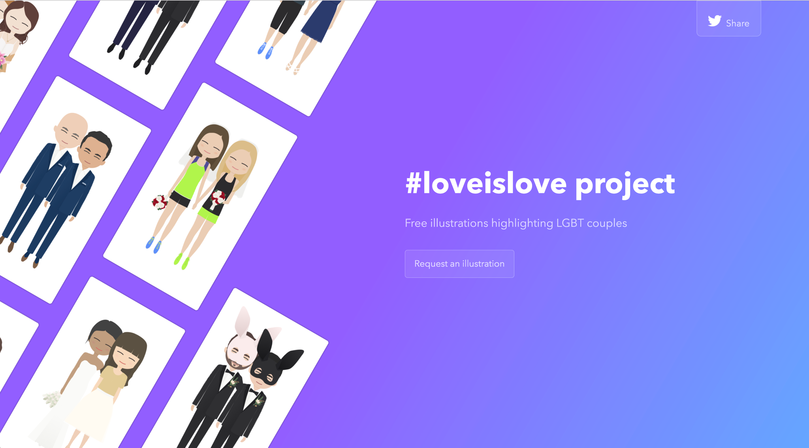

**#loveislove Project**

Michelle Venetucci Harvey started the #loveislove project after the 2016 election, in response to the fear felt by individuals in the LGBT community. In support of the fact that everyone deserves love (and all the rights that come along with that), she's offering free digital illustrations of LGBT couples in hopes of providing a tiny moment of happiness and support.
Couples or friends and family can request an illustration. These make nice sentimental keepsakes and gifts.

**What to expect**

One illustration of the happy couple, delivered digitally. You will get the opportunity to request changes. Wait times vary based on availability.

**How to request an illustration**

Couples who would like an illustration, or friends and family who would like to gift an illustration, can request one by emailing Michelle or sending her a DM on Twitter. Please include reference photos for the illustration.
